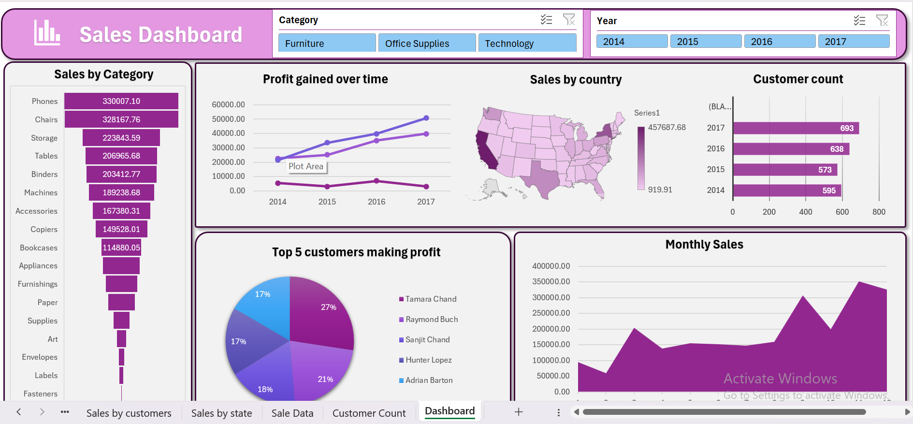

#  Excel Sales Dashboard

This project features an interactive and visually intuitive **Sales Dashboard** built in **Microsoft Excel**. The dashboard leverages data from a structured dataset to analyze and visualize key business metrics, helping stakeholders make informed decisions.

---

##  Dataset Overview

The dataset (`salesdata.csv`) contains transactional data with the following key columns:

- **Date**: Transaction date
- **Region**: Geographical region of the sale
- **Product**: Product name or category
- **Quantity**: Units sold
- **Unit Price**: Price per unit
- **Total Sales**: Total revenue from the transaction

---

##  Dashboard Features

- Total Sales by Region
- Monthly Sales Trend
- Product-wise Performance
- Key Performance Indicators (KPIs)
- Interactive filters and slicers for better analysis

---

##  Screenshot

Here’s a preview of the Excel Dashboard:

<!-- Replace the above path with your actual image path or URL -->

---

##  How to Use

1. Open the Excel file: `Sales_Dashboard.xlsx`
2. Use slicers to filter data by Region, Product, or Month
3. View charts and KPIs for insights
4. Use the data source sheet (`salesdata.csv`) for further analysis

---

##  Tools Used

- Microsoft Excel
- Pivot Tables
- Pivot Charts
- Slicers & Timelines
- Excel Formulas

---
